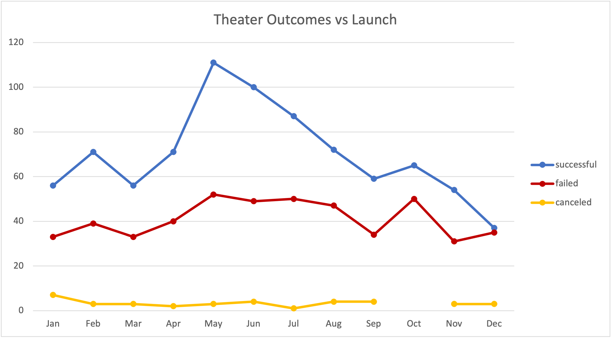
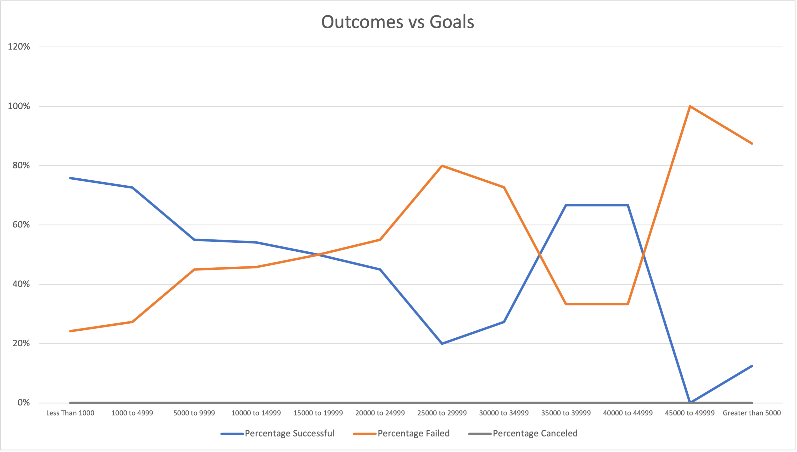

# Kickstarting with Excel

## Overview of Project

The purpose of this study is to give Louise more information about how different the outcome of the different fundraising campaigns was compared to her fundraising campaign.
To give a little more information, Louise's Fever was close to reaching the funds to be realized in a short period of time.

This report contains results drawn from trends found in the data and graphs obtained from the Kickstarter campaigns dataset.

## Analysis and Challenges

The first graph (Theater Outcomes vs Launch) shows the relationship between having a successful or unsuccessful campaign and the time period in which the campaign was launched.

The second graph (Outcomes vs Goals) shows the relationship between the goal ranges and the percentage of successful and unsuccessful campaigns.

There were not many challenges in analyzing the data set because it was well organized.

But one of these small challenges was to be able to transform the date information that came in Unix format to standard date format through the formula =(((\*2/60)/60)/60)/24)+DATE(1970,1,1) so that it could be used in our analysis and understood by Louis.

### Analysis of Outcomes Based on Launch Date

Based on the first graph (Outcomes based on Launch Date) we can conclude that

If the campaign is launched within the period from May to June it has a high probability of being successful and that on the contrary if the campaign is launched between the period of December and January it has a high probability of being unsuccessful compared to the previously mentioned period.

### Analysis of Outcomes Based on Goals

Now in relation to the Outcomes based on Goals graph we can determine that plays that have a goal of less than 4999 have a probability of around 80% of being successful. We can also see the same behavior (80% success rate) in plays that want to be founded in the range of 35000 to 45000. And works over 45000 have between 100% to 80% of not being successful.

### Limitations and Recommendations.

The data being analyzed is from 2009 to 2017 which gives us a large amount of information but represents old information, with old trends that may not tell us the reality of this moment.

We also have limitations in relation to the type of play. If we know whether the plays are comedy or love story for example and this relates to which plays are the most popular then we could advise Louise to do a play with a more defined theme.

One graph or collection of data that Louise could use to get a better understanding of the situation is the average number of donations that should be achieved and the amount each donation should be.
